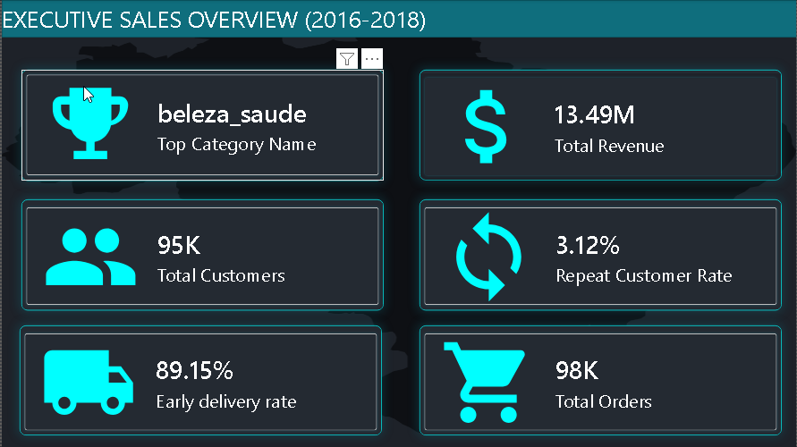
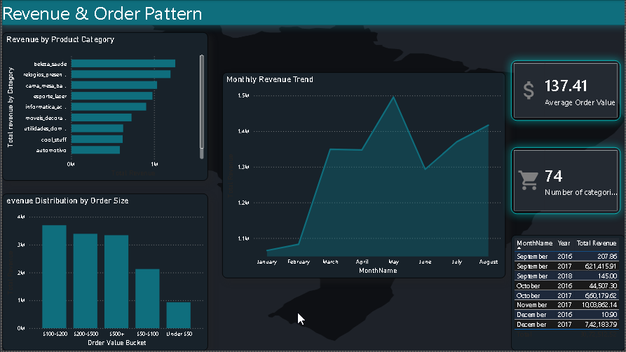
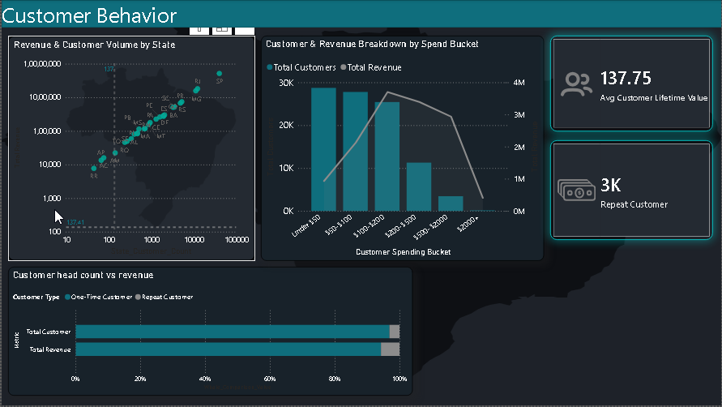

# Ecommerce-analytics-pipeline

**Overview**

This project analyzes ~100K orders from a Brazilian e-commerce platform through a complete data pipeline: cleaning and feature engineering in Python, in-depth analysis in SQL Server, and an interactive Power BI dashboard. Every finding in this project was verified before being trusted — outliers investigated, sample sizes checked, and several real bugs (integer truncation, misleading small-sample averages, broken date relationships) caught and fixed along the way rather than papered over.

## Dashboard Preview

*KPI landing page — revenue, repeat customer rate, delivery performance, and review score at a glance.*

*Category revenue breakdown, seasonal trend, and order-value distribution.*

*State-level customer/revenue relationship, lifetime value distribution, and an interactive metric-switcher (Whale Comparison).*

Full interactive dashboard: [link to hosted .pbix or a Power BI published report, once available]

## Key Findings

- **Only 3.12% of customers ever place a second order** — the vast majority (96.88%) are one-time buyers, a real signal that retention, not just acquisition, may be this platform's biggest growth lever.
- **Delivery lateness devastates review scores immediately, but doesn't get worse with more lateness** — average review score drops from 4.29 (on-time) to 2.99 the moment a delivery is even 1-5 days late, then plateaus around 1.7-1.8 regardless of how much later it gets. The damage happens at the first sign of delay.
- **One state (AP) has a dramatically worse delivery record than the rest of the country** — averaging 72.5 days late across 67 real orders, more than double the next-worst state, despite a legitimate sample size.
- **Revenue is far more evenly distributed across customer spending tiers than order values alone suggest** — at the order level, revenue concentrates heavily in a small number of high-value orders, but at the customer-lifetime level, revenue spreads broadly across a wide range of spending levels.
- **Credit card is the dominant payment method by a wide margin**, and the true installment-adjusted transaction count is meaningfully lower than a naive row count would suggest — a data-quality nuance worth knowing before trusting payment analytics from this kind of dataset.
